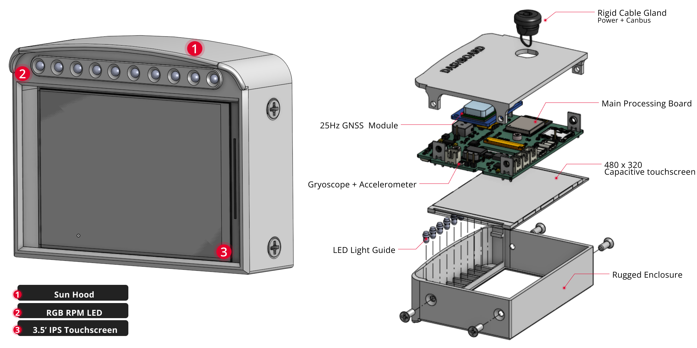
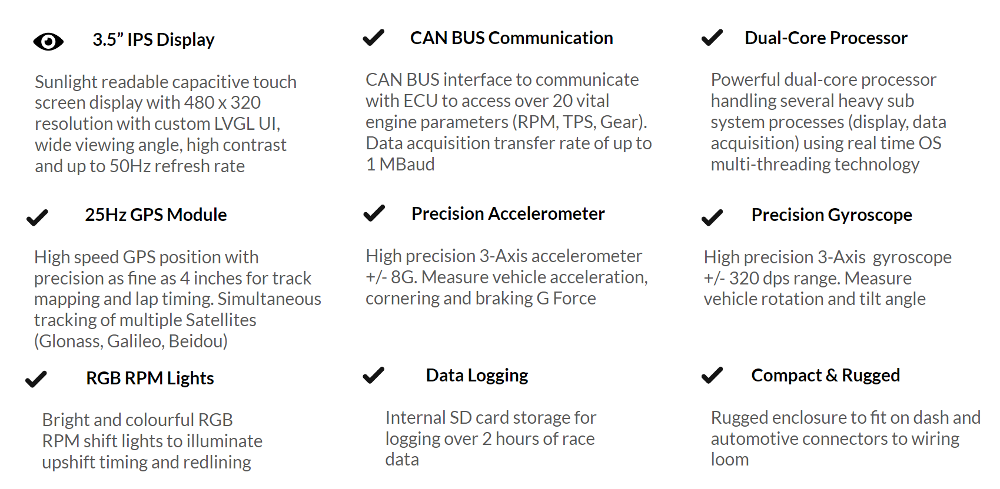
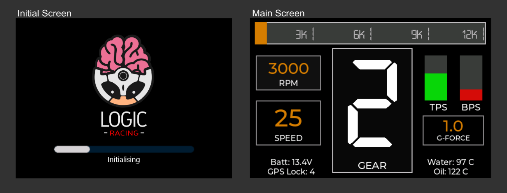

# Racing Dash

The dash is an compact, 3.5’ display, GPS & logger module, designed to provide the driver with real-time data from engine ECU and sensors via CANBUS. The uses range from engine diagnostics to analysis on driver performance post race.

Housed in a lightweight enclosure, the dash features an sunlight readable (>800 $cd/m^2$ luminance) bright IPS display viewable from wide angle range with high contrast.

The display comes with a capacitive touch screen to provide the driver with additional configurability, and with custom UI created using LVGL.

&nbsp;

## Features

## UI

